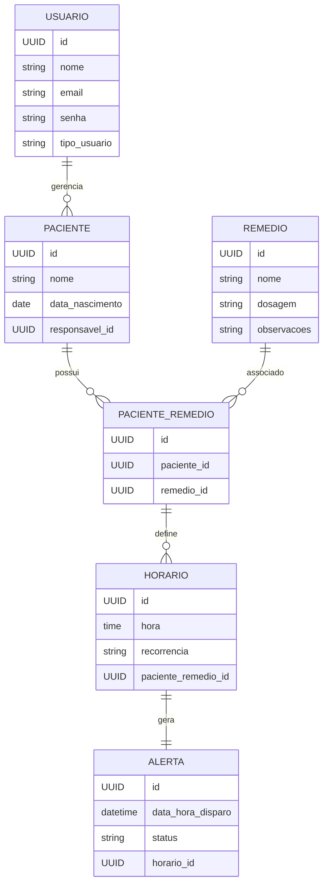

# Regras de Negócio

## Domínio
- **Contexto**: Aplicação para controle/alertas de medicamentos.
- **Escopo**: A solução deverá contemplar: frontend web, backend api, banco de dados mysql, sistema de alertas baseado em eventos/horários.
- **Objetivo**: A aplicação deverá ter o controle de responsáveis, pacientes e medicamentos, e terá um sistema de alertas baseado em eventos/horários, quando chegar a hora do medicamento, o sistema deve enviar um alerta para o paciente e responsável.

## Funcionalidades Principais
- **Gestão de usuários**: Cadastro e login, controle de perfis (responsável / paciente), recuperação de senha, autenticação e autorização.
- **Gestão de Pacientes**: Cadastro de pacientes (feito pelo responsável), associação paciente e responsável, visualização do histórico do paciente.
- **Gestão de Medicamentos**: Cadastro de remédios (nome, dosagem, observações), associação de remédios a pacientes.
- **Gestão de Horários**: Cadastro de hirários para cada remédio, suporte a múltiplis horários por dia, definição de recorrência (diário, semanal, mensal, etc.)
- **Gestão de Alertas**: Geração de alertas baseados nos horários cadastrados, notificação no horário correto, confirmação de uso do remédio (tomado / não tomado).

## Tipos de usuários e permissões
- **Responsável**: Cadastrar e gerenciar pacientes, cadastrar e editar remédios, associar remédios e horários aos pacientes, visualizar alertas e histórico, receber notificações.
- **Paciente**: Visualizar seus remédios e horários, receber alertas, confirmar se tomou ou não o remédio, visualizar histórico pessoal.

## Estilo da arquitetura:
Frontend (Web/Mobile: login, pacientes, remédios, alertas) → REST/JSON → Backend (API REST: autenticação, regras de negócio, scheduler de alertas, permissões) → ORM/SQL → Banco de Dados Relacional (usuários, pacientes, remédios, horários, alertas)

## Entidades principais e relacionamentos

## Especificação da API
- **Endpoints**:
- `POST api/auth/login`: Login para responsáveis e pacientes.
- `POST api/auth/register`: Registro de responsáveis e pacientes.
- `POST api/pacientes`: Cadastro de pacientes.
- `GET api/pacientes`: Listagem de pacientes.
- `GET api/pacientes/{id}`: Detalhes de um paciente.
- `PUT api/pacientes/{id}`: Atualização de um paciente.
- `DELETE api/pacientes/{id}`: Exclusão de um paciente.
- `POST api/remedios`: Cadastro de remédios.
- `GET api/remedios`: Listagem de remédios.
- `PUT api/remedios/{id}`: Atualização de um remédio.
- `DELETE api/remedios/{id}`: Exclusão de um remédio.
- `POST api/pacientes/{id}/remedios`: Associação de um remédio a um paciente.
- `GET api/pacientes/{id}/remedios`: Listagem de remédios associados a um paciente.
- `DELETE api/pacientes/{id}/remedios/{remedioId}`: Remoção de um remédio de um paciente.
- `POST api/horarios`: Cadastro de horários.
- `GET api/horarios`: Listagem de horários.
- `PUT api/horarios/{id}`: Atualização de um horário.
- `DELETE api/horarios/{id}`: Exclusão de um horário.
- `GET api/pacientes/{id}/horários`: Listagem de horários associados a um paciente.
- `GET api/alertas`: Listagem de alertas.
- `GET api/alertas/{id}`: Detalhes de um alerta.
- `PUT api/alertas/{id}`: Atualização de um alerta.
- `DELETE api/alertas/{id}`: Exclusão de um alerta.
- `POST api/alertas/{id}/confirmar`: Confirmar o alerta.

## Segurança e Limitações
- **Token de Autenticação**:
- Obrigatória a utilização de token de autenticação JWT.